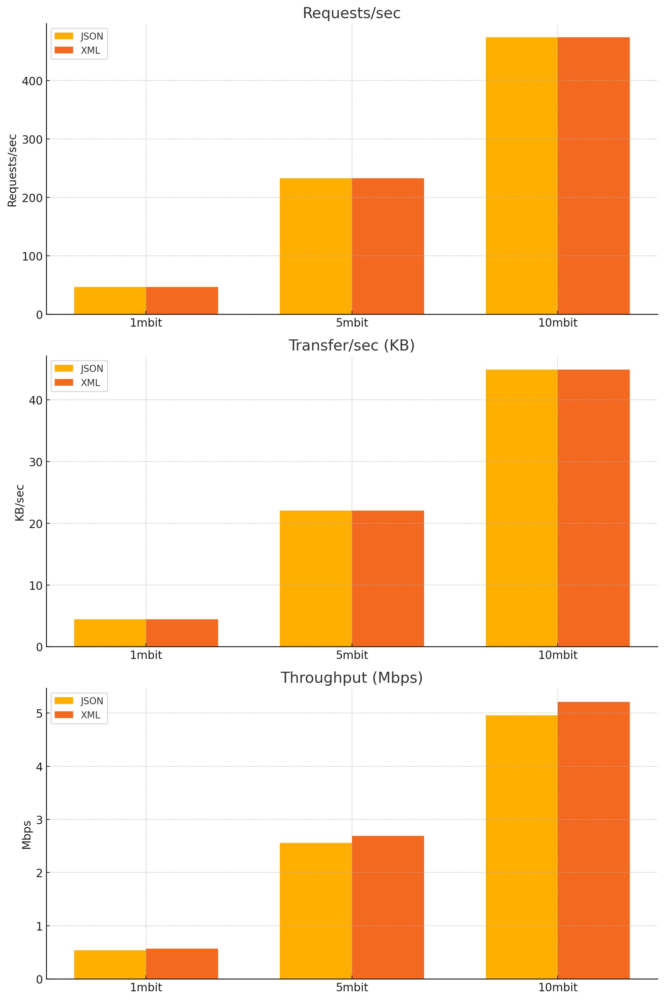

This repo contains a few alternate implementations of [https-notif draft](https://datatracker.ietf.org/doc/draft-ietf-netconf-https-notif/) 

Here we implement the https-notif collector in the following languages :
  - Python
     - Flask
     - Fast API

  - Extended implementation in C
     - libmicrohttpd

  - TBD in go
    - net/http

testing using work tool

my cpu info :
```
$ lscpu
---------------
Architecture:             x86_64
  CPU op-mode(s):         32-bit, 64-bit
  Address sizes:          39 bits physical, 48 bits virtual
  Byte Order:             Little Endian
CPU(s):                   8
  On-line CPU(s) list:    0-7
Vendor ID:                GenuineIntel
  Model name:             Intel(R) Core(TM) i7-8550U CPU @ 1.80GHz
    CPU family:           6
    Model:                142
    Thread(s) per core:   2
    Core(s) per socket:   4
    Socket(s):            1
    Stepping:             10
    CPU max MHz:          4000.0000
    CPU min MHz:          400.0000
    BogoMIPS:             3999.93
    Flags:                fpu vme de pse tsc msr pae mce cx8 apic sep mtrr pge mca cmov pat pse36 clflush dts acpi mmx fxsr sse sse2 ss ht tm pbe syscall nx pdpe1gb rdtscp lm constant_tsc ar
                          t arch_perfmon pebs bts rep_good nopl xtopology nonstop_tsc cpuid aperfmperf pni pclmulqdq dtes64 monitor ds_cpl vmx est tm2 ssse3 sdbg fma cx16 xtpr pdcm pcid sse4
                          _1 sse4_2 x2apic movbe popcnt tsc_deadline_timer aes xsave avx f16c rdrand lahf_lm abm 3dnowprefetch cpuid_fault epb pti ssbd ibrs ibpb stibp tpr_shadow flexpriorit
                          y ept vpid ept_ad fsgsbase tsc_adjust bmi1 avx2 smep bmi2 erms invpcid mpx rdseed adx smap clflushopt intel_pt xsaveopt xsavec xgetbv1 xsaves dtherm ida arat pln pt
                          s hwp hwp_notify hwp_act_window hwp_epp vnmi md_clear flush_l1d arch_capabilities
Virtualization features:  
  Virtualization:         VT-x
Caches (sum of all):      
  L1d:                    128 KiB (4 instances)
  L1i:                    128 KiB (4 instances)
  L2:                     1 MiB (4 instances)
  L3:                     8 MiB (1 instance)
NUMA:                     
  NUMA node(s):           1
  NUMA node0 CPU(s):      0-7
Vulnerabilities:          
  Gather data sampling:   Mitigation; Microcode
  Itlb multihit:          KVM: Mitigation: VMX disabled
  L1tf:                   Mitigation; PTE Inversion; VMX conditional cache flushes, SMT vulnerable
  Mds:                    Mitigation; Clear CPU buffers; SMT vulnerable
  Meltdown:               Mitigation; PTI
  Mmio stale data:        Mitigation; Clear CPU buffers; SMT vulnerable
  Reg file data sampling: Not affected
  Retbleed:               Mitigation; IBRS
  Spec rstack overflow:   Not affected
  Spec store bypass:      Mitigation; Speculative Store Bypass disabled via prctl
  Spectre v1:             Mitigation; usercopy/swapgs barriers and __user pointer sanitization
  Spectre v2:             Mitigation; IBRS; IBPB conditional; STIBP conditional; RSB filling; PBRSB-eIBRS Not affected; BHI Not affected
  Srbds:                  Mitigation; Microcode
  Tsx async abort:        Not affected
```

following : Workers = 2 * number of CPU cores + 1

ame machine for client and erver, o I ill run  2 core each

## 100 client(go routine)

## Flask:
```
gunicorn -w 5 --certfile=../../certs/server.crt --keyfile=../../certs/server.key -b 127.0.0.1:4433 app:app```
```

results 

####  get capabilitie:

```
$ go-wrk -no-vr -c 100 -d 30 -cpus 2 https://localhost:4433/capabilities
---------------
Running 30s test @ https://localhost:4433/capabilities
  100 goroutine(s) running concurrently
22081 requests in 30.079141505s, 7.56MB read
Requests/sec:		734.10
Transfer/sec:		257.36KB
Overall Requests/sec:	730.99
Overall Transfer/sec:	256.27KB
Fastest Request:	17.969ms
Avg Req Time:		136.221ms
Slowest Request:	192.599ms
Number of Errors:	0
10%:			42.151ms
50%:			118.883ms
75%:			119.795ms
99%:			120.323ms
99.9%:			120.359ms
99.9999%:		120.359ms
99.99999%:		120.359ms


```

#### post - xml
```
go-wrk -no-vr -M POST -c 100 -d 30 -cpus 2 -H "Content-Type: application/xml" -body @data.xml  https://localhost:4433/relay-notification
-------------------
Running 30s test @ https://localhost:4433/relay-notification
  100 goroutine(s) running concurrently
20715 requests in 30.085145174s, 1.92MB read
Requests/sec:		688.55
Transfer/sec:		65.22KB
Overall Requests/sec:	685.52
Overall Transfer/sec:	64.94KB
Fastest Request:	22.285ms
Avg Req Time:		145.233ms
Slowest Request:	223.743ms
Number of Errors:	0
10%:			48.553ms
50%:			126.843ms
75%:			127.655ms
99%:			128.007ms
99.9%:			128.019ms
99.9999%:		128.019ms
99.99999%:		128.019ms
stddev:			18.36ms


```

#### post json

```
go-wrk -no-vr -M POST -c 100 -d 30 -cpus 2 -H "Content-Type: application/json" -body @data.json  https://localhost:4433/relay-notification
-------------
Running 30s test @ https://localhost:4433/relay-notification
  100 goroutine(s) running concurrently
21745 requests in 30.066116623s, 2.01MB read
Requests/sec:		723.24
Transfer/sec:		68.51KB
Overall Requests/sec:	720.16
Overall Transfer/sec:	68.22KB
Fastest Request:	37.54ms
Avg Req Time:		138.266ms
Slowest Request:	170.639ms
Number of Errors:	0
10%:			62.113ms
50%:			125.123ms
75%:			125.771ms
99%:			126.087ms
99.9%:			126.095ms
99.9999%:		126.095ms
99.99999%:		126.095ms
stddev:			9.575ms

```


-------------------------------------

## fast_Api

```
gunicorn -w 5 --certfile=../../certs/server.crt --keyfile=../../certs/server.key -k uvicorn.workers.UvicornWorker main:app --bind 127.0.0.1:4433
```


#### get capabilitie:

```
$ go-wrk -no-vr -c 100 -d 30 -cpus 2 https://localhost:4433/capabilities
---------------
Running 30s test @ https://localhost:4433/capabilities
  100 goroutine(s) running concurrently
188870 requests in 29.995154664s, 100.15MB read
Requests/sec:		6296.68
Transfer/sec:		3.34MB
Overall Requests/sec:	6270.42
Overall Transfer/sec:	3.32MB
Fastest Request:	2.284ms
Avg Req Time:		15.88ms
Slowest Request:	96.843ms
Number of Errors:	0
10%:			5.814ms
50%:			6.951ms
75%:			7.253ms
99%:			7.446ms
99.9%:			7.451ms
99.9999%:		7.452ms
99.99999%:		7.452ms
stddev:			5.667ms
```

#### post - xml
```
go-wrk -no-vr -M POST -c 100 -d 30 -cpus 2 -H "Content-Type: application/xml" -body @data.xml  https://localhost:4433/relay-notification
-------------------

Running 30s test @ https://localhost:4433/relay-notification
  100 goroutine(s) running concurrently
147359 requests in 29.999537057s, 7.87MB read
Requests/sec:		4912.04
Transfer/sec:		268.63KB
Overall Requests/sec:	4893.13
Overall Transfer/sec:	267.59KB
Fastest Request:	2.971ms
Avg Req Time:		20.357ms
Slowest Request:	138.543ms
Number of Errors:	0
10%:			5.571ms
50%:			5.899ms
75%:			6.247ms
99%:			6.48ms
99.9%:			6.488ms
99.9999%:		6.489ms
99.99999%:		6.489ms
stddev:			10.694ms


```

#### post json

```
go-wrk -no-vr -M POST -c 100 -d 30 -cpus 2 -H "Content-Type: application/json" -body @data.json  https://localhost:4433/relay-notification
-------------
Running 30s test @ https://localhost:4433/relay-notification
  100 goroutine(s) running concurrently
167312 requests in 29.996081982s, 8.94MB read
Requests/sec:		5577.80
Transfer/sec:		305.04KB
Overall Requests/sec:	5550.49
Overall Transfer/sec:	303.54KB
Fastest Request:	1.183ms
Avg Req Time:		17.927ms
Slowest Request:	106.155ms
Number of Errors:	0
10%:			5.061ms
50%:			5.915ms
75%:			6.166ms
99%:			6.348ms
99.9%:			6.358ms
99.9999%:		6.359ms
99.99999%:		6.359ms
stddev:			8.516ms
```


---------------------------------------------

## C language

```
./client_sample 127.0.0.1 4433
Address type: IPv4 | 4433
Starting collector on 127.0.0.1:4433
```

#### get capabilitie:

```
$ go-wrk -no-vr -c 100 -d 30 -cpus 2 https://localhost:4433/capabilities
---------------

Running 30s test @ https://localhost:4433/capabilities
  100 goroutine(s) running concurrently
10326 requests in 35.69896864s, 1.99MB read
Requests/sec:		289.25
Transfer/sec:		57.06KB
Overall Requests/sec:	139.59
Overall Transfer/sec:	27.54KB
Fastest Request:	29.991ms
Avg Req Time:		71.468ms
Slowest Request:	24.281087s
Number of Errors:	2
Error Counts:		connection reset by peer=2
10%:			31.035ms
50%:			32.484ms
75%:			33.213ms
99%:			33.923ms
99.9%:			33.927ms
99.9999%:		33.927ms
99.99999%:		33.927ms
stddev:			634.401ms
```

#### post - xml
```
go-wrk -no-vr -M POST -c 100 -d 30 -cpus 2 -H "Content-Type: application/xml" -body @data.xml  https://localhost:4433/relay-notification
--------------
Running 30s test @ https://localhost:4433/relay-notification
  100 goroutine(s) running concurrently
3678 requests in 28.62611789s, 337.63KB read
Requests/sec:		128.48
Transfer/sec:		11.79KB
Overall Requests/sec:	33.71
Overall Transfer/sec:	3.09KB
Fastest Request:	145.536ms
Avg Req Time:		584.354ms
Slowest Request:	30.816255s
Number of Errors:	32
Error Counts:		net/http: timeout awaiting response headers=26,connection reset by peer=6
10%:			177.231ms
50%:			200.759ms
75%:			202.983ms
99%:			204.495ms
99.9%:			204.647ms
99.9999%:		204.647ms
99.99999%:		204.647ms
stddev:			1.374835s


```

#### post json

```
go-wrk -no-vr -M POST -c 100 -d 30 -cpus 2 -H "Content-Type: application/json" -body @data.json  https://localhost:4433/relay-notification
-------------
Running 30s test @ https://localhost:4433/relay-notification
  100 goroutine(s) running concurrently
3974 requests in 29.026181257s, 368.68KB read
Requests/sec:		136.91
Transfer/sec:		12.70KB
Overall Requests/sec:	71.10
Overall Transfer/sec:	6.60KB
Fastest Request:	32.339ms
Avg Req Time:		577.26ms
Slowest Request:	30.661631s
Number of Errors:	23
Error Counts:		net/http: timeout awaiting response headers=22,connection reset by peer=1
10%:			37.447ms
50%:			55.013ms
75%:			61.079ms
99%:			68.407ms
99.9%:			68.431ms
99.9999%:		68.431ms
99.99999%:		68.431ms
stddev:			1.628897s

```


## 500 clients

## Flask

#### get capabilitie

```
go-wrk -no-vr -c 500 -d 30 -cpus 2 https://localhost:4433/capabilities
----
Running 30s test @ https://localhost:4433/capabilities
  500 goroutine(s) running concurrently
23108 requests in 30.392993451s, 7.91MB read
Requests/sec:		760.31
Transfer/sec:		266.55KB
Overall Requests/sec:	736.90
Overall Transfer/sec:	258.35KB
Fastest Request:	297.744ms
Avg Req Time:		657.629ms
Slowest Request:	897.279ms
Number of Errors:	0
10%:			318.847ms
50%:			407.071ms
75%:			472.543ms
99%:			541.183ms
99.9%:			544.895ms
99.9999%:		544.895ms
99.99999%:		544.895ms
stddev:			71.361ms
```

#### POST xml

```
go-wrk -no-vr -M POST -c 500 -d 30 -cpus 2 -H "Content-Type: application/xml" -body @data.xml  https://localhost:4433/relay-notification
Running 30s test @ https://localhost:4433/relay-notification
  500 goroutine(s) running concurrently
20696 requests in 30.408015776s, 1.91MB read
Requests/sec:		680.61
Transfer/sec:		64.47KB
Overall Requests/sec:	660.46
Overall Transfer/sec:	62.56KB
Fastest Request:	40.448ms
Avg Req Time:		734.635ms
Slowest Request:	1.007423s
Number of Errors:	0
10%:			85.467ms
50%:			185.575ms
75%:			249.639ms
99%:			310.271ms
99.9%:			312.911ms
99.9999%:		312.911ms
99.99999%:		312.911ms
stddev:			109.313ms
```

#### POST json

```
Running 30s test @ https://localhost:4433/relay-notification
  500 goroutine(s) running concurrently
21613 requests in 30.419528717s, 2.00MB read
Requests/sec:		710.50
Transfer/sec:		67.30KB
Overall Requests/sec:	692.92
Overall Transfer/sec:	65.64KB
Fastest Request:	22.123ms
Avg Req Time:		703.732ms
Slowest Request:	1.110079s
Number of Errors:	0
10%:			80.179ms
50%:			173.215ms
75%:			235.383ms
99%:			296.975ms
99.9%:			298.063ms
99.9999%:		298.063ms
99.99999%:		298.063ms
stddev:			88.288ms
```

## fast api

#### get 
```
go-wrk -no-vr -c 500 -d 30 -cpus 2 https://localhost:4433/capabilities
Running 30s test @ https://localhost:4433/capabilities
  500 goroutine(s) running concurrently
203692 requests in 30.045083046s, 108.01MB read
Requests/sec:		6779.55
Transfer/sec:		3.59MB
Overall Requests/sec:	6577.40
Overall Transfer/sec:	3.49MB
Fastest Request:	14.479ms
Avg Req Time:		73.751ms
Slowest Request:	378.127ms
Number of Errors:	0
10%:			41.167ms
50%:			42.551ms
75%:			42.835ms
99%:			43.047ms
99.9%:			43.051ms
99.9999%:		43.053ms
99.99999%:		43.053ms
stddev:			21.448ms
```

#### POST xml

```
go-wrk -no-vr -M POST -c 500 -d 30 -cpus 2 -H "Content-Type: application/xml" -body @data.xml  https://localhost:4433/relay-notification
Running 30s test @ https://localhost:4433/relay-notification
  500 goroutine(s) running concurrently
164177 requests in 30.046292769s, 8.77MB read
Requests/sec:		5464.14
Transfer/sec:		298.82KB
Overall Requests/sec:	5339.30
Overall Transfer/sec:	291.99KB
Fastest Request:	30.822ms
Avg Req Time:		91.505ms
Slowest Request:	378.127ms
Number of Errors:	0
10%:			47.111ms
50%:			52.049ms
75%:			53.957ms
99%:			55.531ms
99.9%:			55.621ms
99.9999%:		55.631ms
99.99999%:		55.631ms
stddev:			20.895ms
```

#### POST json
```
go-wrk -no-vr -M POST -c 500 -d 30 -cpus 2 -H "Content-Type: application/json" -body @data.json  https://localhost:4433/relay-notification
Running 30s test @ https://localhost:4433/relay-notification
  500 goroutine(s) running concurrently
186485 requests in 30.039152981s, 9.96MB read
Requests/sec:		6208.06
Transfer/sec:		339.50KB
Overall Requests/sec:	6075.95
Overall Transfer/sec:	332.28KB
Fastest Request:	1.322ms
Avg Req Time:		80.54ms
Slowest Request:	498.831ms
Number of Errors:	0
10%:			30.131ms
50%:			32.022ms
75%:			32.733ms
99%:			33.175ms
99.9%:			33.183ms
99.9999%:		33.187ms
99.99999%:		33.187ms
stddev:			38.892ms
```

## 1000 clients

## Flask

#### get
```
go-wrk -no-vr -c 1000 -d 30 -cpus 2 https://localhost:4433/capabilities
Running 30s test @ https://localhost:4433/capabilities
  1000 goroutine(s) running concurrently
22081 requests in 30.888647732s, 7.56MB read
Requests/sec:		714.86
Transfer/sec:		250.62KB
Overall Requests/sec:	672.04
Overall Transfer/sec:	235.61KB
Fastest Request:	147.376ms
Avg Req Time:		1.398878s
Slowest Request:	2.027711s
Number of Errors:	0
10%:			166.951ms
50%:			265.503ms
75%:			329.103ms
99%:			400.383ms
99.9%:			401.279ms
99.9999%:		401.279ms
99.99999%:		401.279ms
stddev:			265.083ms
```

#### POST xml
```
go-wrk -no-vr -M POST -c 1000 -d 30 -cpus 2 -H "Content-Type: application/xml" -body @data.xml  https://localhost:4433/relay-notification
Running 30s test @ https://localhost:4433/relay-notification
  1000 goroutine(s) running concurrently
20839 requests in 30.881755215s, 1.93MB read
Requests/sec:		674.80
Transfer/sec:		63.92KB
Overall Requests/sec:	635.27
Overall Transfer/sec:	60.18KB
Fastest Request:	203.696ms
Avg Req Time:		1.48192s
Slowest Request:	1.817599s
Number of Errors:	0
10%:			218.303ms
50%:			313.423ms
75%:			376.399ms
99%:			439.439ms
99.9%:			439.743ms
99.9999%:		439.743ms
99.99999%:		439.743ms
stddev:			208.777ms
```

#### POST json
```
go-wrk -no-vr -M POST -c 1000 -d 30 -cpus 2 -H "Content-Type: application/json" -body @data.json  https://localhost:4433/relay-notification
Running 30s test @ https://localhost:4433/relay-notification
  1000 goroutine(s) running concurrently
21610 requests in 31.009274475s, 2.00MB read
Requests/sec:		696.89
Transfer/sec:		66.01KB
Overall Requests/sec:	651.65
Overall Transfer/sec:	61.73KB
Fastest Request:	172.504ms
Avg Req Time:		1.43495s
Slowest Request:	2.018111s
Number of Errors:	0
10%:			190.239ms
50%:			300.383ms
75%:			364.575ms
99%:			430.623ms
99.9%:			432.527ms
99.9999%:		432.527ms
99.99999%:		432.527ms
stddev:			231.545ms
```

## Fast API
#### get
```
go-wrk -no-vr -c 1000 -d 30 -cpus 2 https://localhost:4433/capabilities
Running 30s test @ https://localhost:4433/capabilities
  1000 goroutine(s) running concurrently
203399 requests in 30.080768238s, 107.85MB read
Requests/sec:		6761.76
Transfer/sec:		3.59MB
Overall Requests/sec:	6453.68
Overall Transfer/sec:	3.42MB
Fastest Request:	1.646ms
Avg Req Time:		147.89ms
Slowest Request:	801.887ms
Number of Errors:	0
10%:			90.419ms
50%:			101.471ms
75%:			103.267ms
99%:			104.275ms
99.9%:			104.307ms
99.9999%:		104.311ms
99.99999%:		104.311ms
stddev:			43.588ms
```

#### POST xml
```
go-wrk -no-vr -M POST -c 1000 -d 30 -cpus 2 -H "Content-Type: application/xml" -body @data.xml  https://localhost:4433/relay-notification
Running 30s test @ https://localhost:4433/relay-notification
  1000 goroutine(s) running concurrently
142449 requests in 29.458154173s, 7.61MB read
Requests/sec:		4835.64
Transfer/sec:		264.45KB
Overall Requests/sec:	4340.39
Overall Transfer/sec:	237.37KB
Fastest Request:	113.756ms
Avg Req Time:		206.797ms
Slowest Request:	1.931711s
Number of Errors:	1228
Error Counts:		net/http: timeout awaiting response headers=1228
10%:			129.251ms
50%:			135.415ms
75%:			136.903ms
99%:			138.535ms
99.9%:			138.567ms
99.9999%:		138.567ms
99.99999%:		138.567ms
stddev:			108.013ms
```

#### POST json
```
go-wrk -no-vr -M POST -c 1000 -d 30 -cpus 2 -H "Content-Type: application/json" -body @data.json  https://localhost:4433/relay-notification
Running 30s test @ https://localhost:4433/relay-notification
  1000 goroutine(s) running concurrently
187411 requests in 30.073806246s, 10.01MB read
Requests/sec:		6231.70
Transfer/sec:		340.80KB
Overall Requests/sec:	5948.56
Overall Transfer/sec:	325.31KB
Fastest Request:	77.268ms
Avg Req Time:		160.469ms
Slowest Request:	806.015ms
Number of Errors:	0
10%:			98.027ms
50%:			104.479ms
75%:			107.359ms
99%:			109.215ms
99.9%:			109.271ms
99.9999%:		109.275ms
99.99999%:		109.275ms
stddev:			39.978ms
```

---

# Variational requests


### lua script for Get variation
```lua
-- sequence.lua
local headers = {
    ["Accept"] = "application/json"
}

request = function()
    local q_value_json = math.random()  -- Random q value between 0 and 1
    local q_value_xml = math.random()   -- Random q value between 0 and 1

    -- Randomly decide the combination of Accept header
    local accept_header = ""

    -- Randomly choose between:
    -- 1. application/json or application/xml with q value
    -- 2. both application/json and application/xml without q value
    -- 3. Only one of application/json or application/xml

    local choice = math.random(1, 3)
    
    if choice == 1 then
        -- Include both JSON and XML with q values
        accept_header = "application/json;q=" .. string.format("%.1f", q_value_json) .. ", application/xml;q=" .. string.format("%.1f", q_value_xml)
    elseif choice == 2 then
        -- Include both JSON and XML without q values
        accept_header = "application/json, application/xml"
    else
        -- Randomly choose between JSON or XML alone
        if math.random() > 0.5 then
            accept_header = "application/json;q=" .. string.format("%.1f", q_value_json)
        else
            accept_header = "application/xml;q=" .. string.format("%.1f", q_value_xml)
        end
    end

    -- Set the Accept header for the request
    headers["Accept"] = accept_header
    
    -- Send the GET request to the /capabilities endpoint with the dynamic headers
    return wrk.format("GET", "/capabilities", headers)
end
```

### lua script for sequence of packets being sent
```lua
-- Persistent counter for each thread
local counter = 0

-- Initialize the thread
function init(args)
    counter = 0  -- Start the counter at 0 for each thread
end

-- Request sequence logic
function request()
    counter = counter + 1  -- Increment the counter for each request

    -- Handle the sequence of requests
    if counter == 1 then
        wrk.method = "GET"
        wrk.path = "/capabilities"
        return wrk.format(nil)
    elseif counter == 2 then
        wrk.method = "POST"
        wrk.path = "/relay-notification"
        wrk.body = '{"ietf-https-notif:notification": {"eventTime": "2013-12-21T00:01:00Z", "event": {"event-class": "fault", "reporting-entity": {"card": "Ethernet0"}, "severity": "major"}}}'
        wrk.headers["Content-Type"] = "application/json"
        return wrk.format(nil)
    elseif counter == 3 then
        wrk.method = "POST"
        wrk.path = "/relay-notification"
        wrk.body = '{"ietf-https-notif:notification": {"eventTime": "2013-12-21T00:01:00Z", "event": {"event-class": "fault"}}'  -- Malformed JSON
        wrk.headers["Content-Type"] = "application/json"
        return wrk.format(nil)
    elseif counter == 4 then
        wrk.method = "POST"
        wrk.path = "/relay-notification"
        wrk.body = [[
<notification xmlns="urn:ietf:params:xml:ns:netconf:notification:1.0">
  <eventTime>2013-12-21T00:01:00Z</eventTime>
  <event>
    <event-class>fault</event-class>
    <reporting-entity>
      <card>Ethernet0</card>
    </reporting-entity>
    <severity>major</severity>
  </event>
</notification>
]]
        wrk.headers["Content-Type"] = "application/xml"
        return wrk.format(nil)
    elseif counter == 5 then
        wrk.method = "POST"
        wrk.path = "/relay-notification"
        wrk.body = [[
<notification xmlns="urn:ietf:params:xml:ns:netconf:notification:1.0">
  <eventTime>2013-12-21T00:01:00Z</eventTime>
  <event>
    <event-class>fault</event-class>
    <reporting-entity>
      <card>Ethernet0</card>
    </reporting-entity>
]]  -- Malformed XML
        wrk.headers["Content-Type"] = "application/xml"
        return wrk.format(nil)
    elseif counter == 6 then
        wrk.method = "GET"
        wrk.path = "/nonexistent-endpoint"
        return wrk.format(nil)
    else
        counter = 0  -- Reset the counter after the last request
        return request()  -- Restart the sequence
    end
end
```

## Flask

#### Sending GET /capabilities with different accept headers

testing done using 4 threads and for 30 secs

#### 10 clients

```
wrk -t4 -c10 -d30s -s get_seq.lua https://127.0.0.1:4433/capabilities
Running 30s test @ https://127.0.0.1:4433/capabilities
  4 threads and 10 connections
  Thread Stats   Avg      Stdev     Max   +/- Stdev
    Latency     2.48ms    1.60ms  23.39ms   76.67%
    Req/Sec   134.90     17.76   171.00     76.00%
  16160 requests in 30.06s, 5.85MB read
Requests/sec:    537.67
Transfer/sec:    199.21KB
```

#### 100 clients
```
wrk -t4 -c100 -d30s -s get_seq.lua https://127.0.0.1:4433/capabilities
Running 30s test @ https://127.0.0.1:4433/capabilities
  4 threads and 100 connections
  Thread Stats   Avg      Stdev     Max   +/- Stdev
    Latency     3.11ms    1.87ms  31.00ms   70.52%
    Req/Sec   122.61     49.72   252.00     65.71%
  14639 requests in 30.08s, 5.30MB read
Requests/sec:    486.68
Transfer/sec:    180.34KB
```

#### 500 clients


-----


# Bandwidth Testing

> Rough Docs

### Summary of the Test Environment Setup

#### 1. **Network Namespace Setup**
- We create two network namespaces: `publisher_ns` (client) and `collector_ns` (server). These namespaces simulate isolated environments to mimic a real-world client-server interaction.
- A virtual Ethernet pair (`veth0` and `veth1`) connects these namespaces, where `veth0` resides in `publisher_ns` and `veth1` resides in `collector_ns`.
- The virtual Ethernet interfaces are configured with appropriate IP addresses, enabling communication between the namespaces.

#### 2. **Running the Collector**
- The server application (referred to as the collector) is hosted in the `collector_ns` namespace, listening on a predefined IP and port (e.g., `192.168.1.2:8080`).
- This setup allows the publisher in `publisher_ns` to send HTTP requests to the collector over the virtual Ethernet link.

#### 3. **Script to Change Bandwidth and Run Tests**
- The provided script automates bandwidth control, HTTP request generation, and throughput measurement:
  1. **Bandwidth Control**: The `tc` (traffic control) command is used to set bandwidth limits (`1mbit`, `5mbit`, `10mbit`) on the virtual Ethernet interfaces (`veth0` and `veth1`). The command applies a Token Bucket Filter (TBF) queuing discipline to simulate constrained network conditions with a specified burst size (`32kbit`) and latency (`50ms`).
  2. **Request Generation**: The script uses `go-wrk`, a benchmarking tool, to send HTTP POST requests from `publisher_ns` to `collector_ns`. It supports JSON and XML payloads, specified by the `ENCODINGS` array.
  3. **Traffic Measurement**: The script captures the number of transmitted bytes (`TX bytes`) on `veth0` in `publisher_ns` before and after running the test using the `ip -s link show` command.

#### 4. **Calculating Throughput**
- **TX Bytes Measurement**: The script calculates the difference in transmitted bytes (`TX bytes`) on `veth0` before and after the test.
- **Throughput Formula**: 
  \[
  \text{Throughput (Mbps)} = \frac{(\text{TX End} - \text{TX Start}) \times 8}{\text{Test Duration (30 seconds)} \times 1024 \times 1024}
  \]
  This formula converts the transmitted data from bytes to megabits per second.

#### 5. **Output**
- The script generates a table summarizing the results:
  - **Bandwidth**: Bandwidth limit applied to the link.
  - **Encoding**: Payload format (`json` or `xml`).
  - **Requests/sec**: HTTP requests processed per second (from `go-wrk` output).
  - **Transfer/sec**: Amount of data transferred per second (e.g., in KB/sec).
  - **Throughput (Mbps)**: Effective data transfer rate over the link.

### Script Workflow
- Bandwidth and encoding configurations are iteratively applied.
- HTTP requests are sent using `go-wrk`, and results are parsed to extract `Requests/sec` and `Transfer/sec`.
- TX bytes are captured before and after each test, and throughput is calculated.
- Results are printed in a tabular format for analysis.


## Setup commands:

```bash
sudo ip netns add publisher_ns
sudo ip netns add collector_ns

sudo ip link add veth0 type veth peer name veth1
sudo ip link set veth0 netns publisher_ns
sudo ip link set veth1 netns collector_ns

sudo ip netns exec publisher_ns ip addr add 192.168.1.1/24 dev veth0
sudo ip netns exec collector_ns ip addr add 192.168.1.2/24 dev veth1
sudo ip netns exec publisher_ns ip link set veth0 up
sudo ip netns exec collector_ns ip link set veth1 up
sudo ip netns exec publisher_ns ip link set lo up
sudo ip netns exec collector_ns ip link set lo up
```

## script 

```bash
#!/bin/bash

BANDWIDTHS=("1mbit" "5mbit" "10mbit")
ENCODINGS=("json" "xml")
BURST="32kbit"       # Adjust as per your requirement
LATENCY="50ms"       # Simulate 50ms network latency

# IP address of the collector (server) namespace
SERVER_IP="192.168.1.2:8080"

# Header for the table
echo -e "Bandwidth\tEncoding\tRequests/sec\tTransfer/sec\tThroughput (Mbps)"

for bw in "${BANDWIDTHS[@]}"; do
    sudo ip netns exec publisher_ns tc qdisc change dev veth0 root tbf rate $bw burst $BURST latency $LATENCY
    sudo ip netns exec collector_ns tc qdisc change dev veth1 root tbf rate $bw burst $BURST latency $LATENCY

    for encoding in "${ENCODINGS[@]}"; do
        if [ "$encoding" == "json" ]; then
            body_file="data.json"
            content_type="application/json"
        else
            body_file="data.xml"
            content_type="application/xml"
        fi

	# Capture TX bytes before the test
	tx_start=$(sudo ip netns exec publisher_ns ip -s link show dev veth0 | awk '/TX:/ {getline; print $1}')

	# Run go-wrk and capture the results
	result=$(sudo ip netns exec publisher_ns go-wrk -no-vr -M POST -c 100 -d 30 -cpus 2 \
    		-H "Content-Type: $content_type" -body @$body_file \
    		https://${SERVER_IP}/relay-notification)

	# Capture TX bytes after the test
	tx_end=$(sudo ip netns exec publisher_ns ip -s link show dev veth0 | awk '/TX:/ {getline; print $1}')


	# Extract values using regex or text processing
        requests_sec=$(echo "$result" | grep -oP 'Overall Requests/sec:\s+\K[\d.]+')
	transfer_sec=$(echo "$result" | grep -oP 'Overall Transfer/sec:\s+\K[\d.]+[A-Za-z]+')

	throughput_mbps=$(echo "scale=2; (($tx_end - $tx_start) * 8) / (30 * 1024 * 1024)" | bc)

        # Output the results in a tabular format
        echo -e "$bw\t$encoding\t$requests_sec\t$transfer_sec\t$throughput_mbps"
    done
done
```
## Results

| Bandwidth | Encoding | Requests/sec | Transfer/sec | Throughput (Mbps) |
|-----------|----------|--------------|--------------|--------------------|
| 1mbit     | json     | 46.52        | 4.41KB       | 0.54              |
| 1mbit     | xml      | 46.46        | 4.40KB       | 0.57              |
| 5mbit     | json     | 232.79       | 22.05KB      | 2.56              |
| 5mbit     | xml      | 232.73       | 22.05KB      | 2.69              |
| 10mbit    | json     | 473.87       | 44.89KB      | 4.96              |
| 10mbit    | xml      | 474.16       | 44.92KB      | 5.21              |

### minor issues
- running gunicorn in the collector_ns was running into some issues
- accessing the go-wrk binary from a different ns
- parsing the output and throughput calculation and data collection

### some terms
Requests/sec: How many requests are being sent per second.
Transfer/sec: How much data is being transferred every second.
Throughput: The actual data transfer rate over the network (in Mbps or MBps).

# Analysis


The graphs above analyze the performance metrics across different bandwidths and encodings. Here's a summary of the insights:

### Observations:
1. **Requests/sec**:
   - Both JSON and XML encodings show a proportional increase in the number of requests processed per second as bandwidth increases.
   - The performance difference between JSON and XML is negligible, indicating similar processing times for these encodings.

2. **Transfer/sec (KB)**:
   - Transfer rates increase linearly with bandwidth, reflecting that more data can be transferred as bandwidth improves.
   - Again, JSON and XML have nearly identical transfer rates, suggesting minimal impact of encoding type on data transfer volume.

3. **Throughput (Mbps)**:
   - Throughput also scales with bandwidth but remains below the theoretical maximum for each bandwidth tier.
   - XML consistently achieves slightly higher throughput than JSON, which might be attributed to its marginally larger data size resulting in slightly higher utilization.

### Key Takeaways:
- The system scales well with bandwidth, maintaining a proportional increase in performance metrics.
- Differences between JSON and XML are minor, with XML slightly outperforming JSON in throughput, likely due to larger payloads per request.
- The throughput achieved is less than the maximum bandwidth, indicating some overhead or limitations in network or application processing efficiency.


### code
```python
import matplotlib.pyplot as plt
import numpy as np


# Data from the table
bandwidths = ["1mbit", "5mbit", "10mbit"]
encodings = ["json", "xml"]
requests_sec = [[46.52, 46.46], [232.79, 232.73], [473.87, 474.16]]
transfer_sec_kb = [[4.41, 4.40], [22.05, 22.05], [44.89, 44.92]]
throughput_mbps = [[0.54, 0.57], [2.56, 2.69], [4.96, 5.21]]


# Prepare the data for plotting
x = np.arange(len(bandwidths))  # Bandwidth index
width = 0.35  # Bar width


# Plot Requests/sec
fig, ax = plt.subplots(3, 1, figsize=(10, 15))


for i, metric, title, ylabel in zip(
    range(3),
    [requests_sec, transfer_sec_kb, throughput_mbps],
    ["Requests/sec", "Transfer/sec (KB)", "Throughput (Mbps)"],
    ["Requests/sec", "KB/sec", "Mbps"]
):
    ax[i].bar(x - width / 2, [metric[j][0] for j in range(len(bandwidths))], width, label="JSON")
    ax[i].bar(x + width / 2, [metric[j][1] for j in range(len(bandwidths))], width, label="XML")
    ax[i].set_title(title)
    ax[i].set_xticks(x)
    ax[i].set_xticklabels(bandwidths)
    ax[i].set_ylabel(ylabel)
    ax[i].legend()


plt.tight_layout()
plt.show()
```
